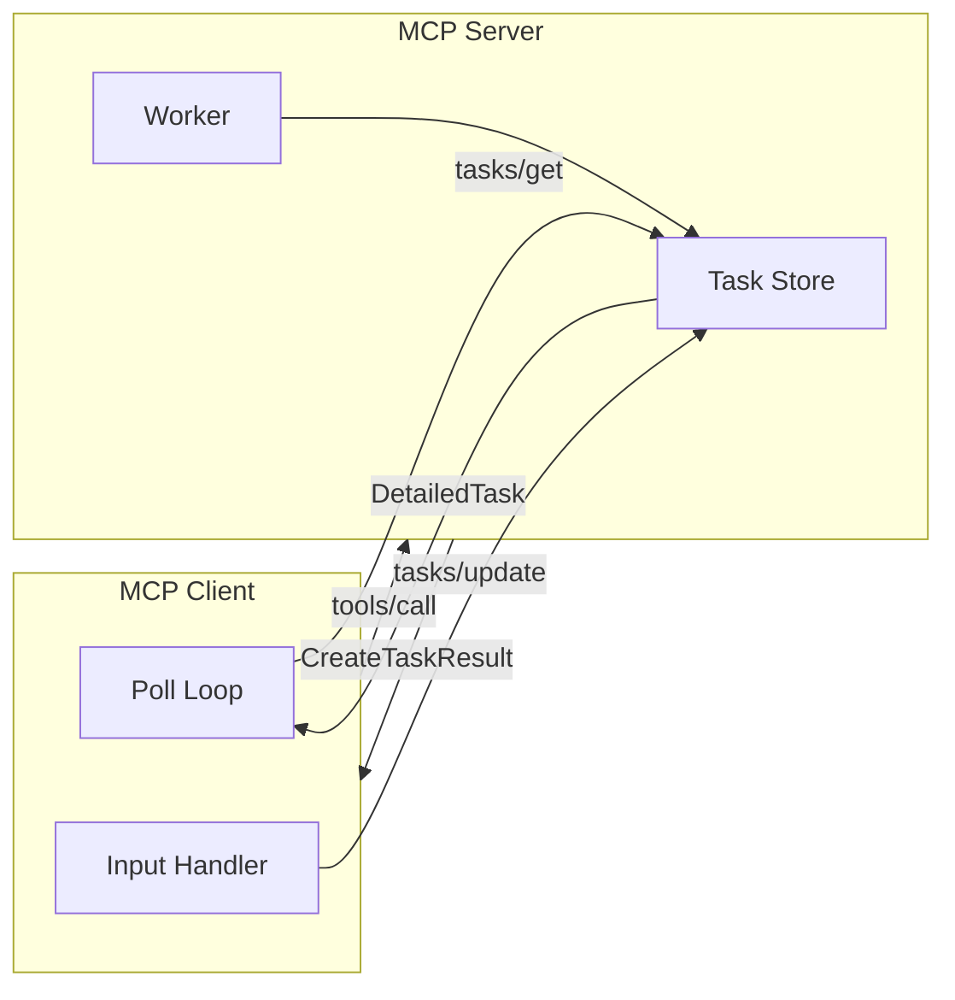
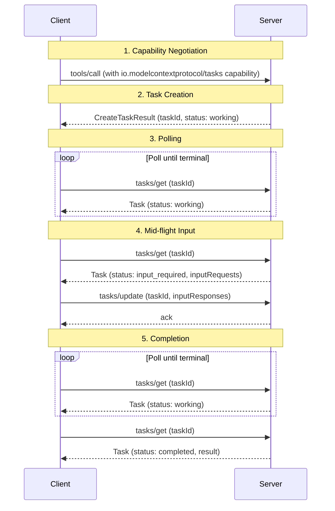
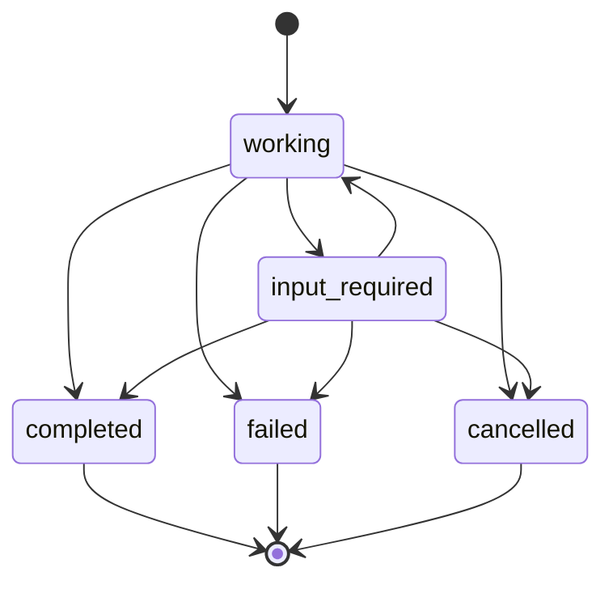

# Overview

MCP Tasks is an extension to the Model Context Protocol. Servers return a durable task handle instead of blocking on a long-running operation; clients poll for progress and retrieve the result when ready.

**Extension Identifier:** `io.modelcontextprotocol/tasks`

## Why Tasks?

Tool calls block until work finishes. Tasks solve the cases where blocking is impractical:

- **CI pipelines and batch jobs** — minutes or hours of execution
- **Human-in-the-loop workflows** — approval gates that block until a person responds
- **External job systems** — cloud deployments, queued work, async APIs with their own job IDs
- **Unreliable connections** — mobile clients, intermittent networks, transport intermediary timeouts

A task ID is a durable handle that survives disconnects and carries status metadata, without requiring long-lived connections or unsolicited server-to-client messages.

## Progressive Enhancement

Servers only return task handles to clients that declared the extension in their per-request capabilities — otherwise, the server either blocks for a regular result as usual or returns a capability error.

A server that requires task support from the client for a given request returns a `-32003` (Missing Required Client Capability) error, like so:

```jsonc
{
  "jsonrpc": "2.0",
  "id": 1,
  "error": {
    // MISSING_REQUIRED_CLIENT_CAPABILITY
    "code": -32003,
    "message": "Missing required client capability",
    "data": {
      "requiredCapabilities": {
        "extensions": {
          "io.modelcontextprotocol/tasks": {}
        }
      }
    }
  }
}
```

## Architecture



- **Client** — Drives all interaction: issues tool calls, polls for completion, and fulfills input requests.
- **Server** — Decides per-request whether to create a task and manages task state durably.
- **Task Store** — Durable state reachable by `tasks/get` even if the worker or connection has died. A `CreateTaskResult` is not returned until the task is findable here.
- **Worker** — The computation backing the task. Updates the task store as it progresses and writes the final result or error on completion.

## Lifecycle



1. **Capability negotiation** — The client includes `io.modelcontextprotocol/tasks` in `_meta.io.modelcontextprotocol/clientCapabilities.extensions`. The server advertises the same in `server/discover`. No per-tool warmup or per-request flag.

2. **Task creation** — The server returns a `CreateTaskResult` with `resultType: "task"`, containing a `taskId`, initial status, TTL, and polling interval. The task is durably created before the response is sent.

3. **Polling** — The client calls `tasks/get` with the `taskId`, respecting `pollIntervalMs`, until the task reaches a terminal status (which includes the final result or error).

4. **Mid-flight input** — If the task moves to `input_required`, `tasks/get` includes an `inputRequests` map that the client fulfills via `tasks/update`, after which the task transitions back to `working`.

5. **Completion** — `completed`: `result` contains what the original request would have returned synchronously. `failed`: `error` contains the JSON-RPC error.

## Task Status



| Status           | Meaning                                                                    |
| ---------------- | -------------------------------------------------------------------------- |
| `working`        | The operation is in progress.                                              |
| `input_required` | The server needs client input before continuing. See `inputRequests`.      |
| `completed`      | The operation finished. `result` contains the final output.                |
| `failed`         | A JSON-RPC error occurred during execution. `error` has details.           |
| `cancelled`      | The operation was cancelled (not always honored).                          |

`completed`, `failed`, and `cancelled` are terminal.

Each task also carries:

- **`statusMessage`** — Optional description of current state
- **`createdAt` / `lastUpdatedAt`** — ISO 8601 timestamps
- **`ttlMs`** — Time-to-live from creation in milliseconds; may change over lifetime; `null` for unlimited
- **`pollIntervalMs`** — Suggested polling interval; may change over lifetime

## Mid-flight Input

When a task needs client input, it transitions to `input_required` and the `tasks/get` response includes an `inputRequests` map. The client fulfills these via `tasks/update`, which returns an empty ack:

```json
{
  "status": "input_required",
  "inputRequests": {
    "approval": {
      "method": "elicitation/create",
      "params": {
        "mode": "form",
        "message": "Approve deployment to production?",
        "requestedSchema": {
          "type": "object",
          "properties": { "approved": { "type": "boolean" } },
          "required": ["approved"]
        }
      }
    }
  }
}
```

Each key in `inputRequests` is unique over the lifetime of a task. The server may accept partial responses; the task remains `input_required` until all arrive. Reads (`tasks/get`) and writes (`tasks/update`) are separate to keep reads idempotent and cacheable.

See the [specification](./specification/draft/tasks) for the full `tasks/update` request shape and consistency semantics.

## Cancellation and Notifications

Clients send `tasks/cancel` to signal cancellation intent. The server acks with an empty result — cancellation is cooperative, and the task may still reach a non-`cancelled` terminal status.

Servers may also push status updates via `notifications/tasks`, which clients opt into through `subscriptions/listen`. Each notification carries the full task state, identical to a `tasks/get` response.

See the [specification](./specification/draft/tasks) for details on both mechanisms.

## Security

- **Task ID unguessability.** Task IDs are generated with sufficient entropy to prevent enumeration, and may serve as bearer tokens for stored state.
- **No task enumeration.** There is no `tasks/list`, so one caller's tasks are not visible to another.
- **Input-request trust model.** `inputRequests` carry elicitation/sampling payloads from server to client. Hosts apply the same trust model as for standard elicitation/sampling requests.

## Supported Methods

Task-augmented execution is currently supported for:

- `tools/call`

## Learn More

- [Specification](./specification/draft/tasks) — Full protocol specification
- [SEP-2663](./seps/2663-tasks-extension.md) — The proposal defining this extension
- [Schema](https://github.com/modelcontextprotocol/ext-tasks/tree/main/schema) — TypeScript types and generated JSON Schema
